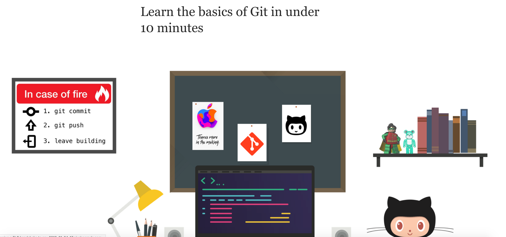

# The Repo for 'Learn the Basics of Git in Under 10 Minutes' on Medium.

# Learn the Basics of Git in Under 10 Minutes

Yes, the title is a clickbait. There is no way you can *understand* the basics of git technology in just 10 minutes. But you can get pretty close in about 25 minutes. And that is the purpose of this article.

If you want to get started on learning about Git technology, you’ve come to the right place. This is a comprehensive beginner’s guide to Git. There are many clients for Git. The technology is all the same no matter the client. But in this guide we’ll be using GitHub to understand Git.

### Let’s get started!

## What is Version Control?
> Version control is a system that records changes to a file or set of files over time so that you can recall specific versions later. So ideally, we can place any file in the computer on version control.

### Umm… Okay… But Why Tho?

### Here’s Why:

A Version Control System (VCS) allows you to revert files back to a previous state, revert the entire project back to a previous state, review changes made over time, see who last modified something that might be causing a problem, who introduced an issue and when, and more. Using a VCS also means that if you screw things up or lose files, you can generally recover easily. And sometimes you just want to know **“who wrote this crap”**, and having access to that information is worthwhile 😈.

## So What is Git?

Git is a version-control system for tracking changes in computer files and coordinating work on those files among multiple people. Git is a ***Distributed Version Control System***. So Git does not necessarily rely on a central server to store all the versions of a project’s files. Instead, every user “clones” a copy of a repository (a collection of files) and has the ***full*** history of the project on their own hard drive. This clone has *all* of the metadata of the original while the original itself is stored on a self-hosted server or a third party hosting service like GitHub.

Git helps you ***keep track of the changes*** you make to your code. It is basically the history tab for your code editor(With no incognito mode 🌚). If at any point while coding you hit a fatal error and don’t know what’s causing it you can always revert back to the stable state. So it is very helpful for debugging. Or you can simply see what changes you made to your code over time.

*A simple example of version history of a file.*

In the example above, all three cards represent different versions of the same file. We can select which version of the file we want to use at any point of time. So I can jump to and fro to any version of the file in the git time continuum.

Git also helps you ***synchronise code*** between multiple people. So imagine you and your friend are collaborating on a project. You both are working on the same project files. Now Git takes those changes you and your friend made independently and merges them to a single “**Master**” repository. So by using Git you can ensure you both are working on the most recent version of the repository. So you don’t have to worry about mailing your files to each other and working with a ridiculous number of copies of the original file. And collaborating long distance becomes as easy as HTML 🙃.

## Git Workflow:

Before we start working with Git commands, it is necessary that you understand what it represents.

### What is a Repository ?

A **repository** a.k.a. **repo** is nothing but a collection of source code.

### There are four fundamental elements in the Git Workflow.

**Working Directory**, **Staging Area**, **Local Repository** and **Remote Repository**.

*Diagram of a simple Git Workflow*

**If you consider a file in your Working Directory, it can be in three possible states.**

1. **It can be staged.** Which means the files with with the updated changes are marked to be committed to the local repository but not yet committed.

1. **It can be modified**. Which means the files with the updated changes are not yet stored in the local repository.

1. **It can be committed**. Which means that the changes you made to your file are safely stored in the local repository.

* git add is a command used to add a file that is in the working directory to the staging area.

* git commit is a command used to add all files that are staged to the local repository.

* git push is a command used to add all committed files in the local repository to the remote repository. So in the remote repository, all files and changes will be visible to anyone with access to the remote repository.

* git fetch is a command used to get files from the remote repository to the local repository but not into the working directory.

* git merge is a command used to get the files from the local repository into the working directory.

* git pull is command used to get files from the remote repository directly into the working directory. It is equivalent to a git fetch and a git merge .

**Now that we know what Git is and it’s basic terminologies, let’s see how we can place a file under git**. We’re going to do it the right way and the difficult way. Without any GUI applications.

I’m assuming you already have a file the you want to place under version control. If not create a sample folder named ‘MuskCult’ and place some sample code files in it.

## Step 0: Make a GitHub Account. Duh.

If you don't already have one, you can make one [here](https://github.com/join).

## Step 1: Make sure you have Git installed on you machine.

If you are on a **Mac**, fire up the terminal and enter the following command:

    $ git --version

This will prompt open an installer if you don’t already have git. So set it up using the installer. If you have git already, it’ll just show you which version of git you have installed.

If you are running **Linux**(deb), enter the following in the terminal:

    $ sudo apt install git-all

If you are on **Windows**:

    $ get a mac

Just kidding… Relax… The amount of people I triggered… Phew…
Go to this [**link](https://www.apple.com/macos/what-is/)** or this** [link](https://gitforwindows.org/)** for more info on how to get it.

## Step 2: Tell Git who you are.

Introduce yourself. Slide in. Seriously, mention your Git username and email address, since every Git commit will use this information to identify you as the author.

    $ git config --global user.name "YOUR_USERNAME"

    $ git config --global user.email "im_satoshi@musk.com"

    $ git config --global --list # To check the info you just provided

## Step 3: Generate/check your machine for existing SSH keys. (Optional)

Why you ask? Using the **SSH protocol**, you can** connect and authenticate** to r**emote servers and services**. With SSH keys, you can connect to GitHub without supplying your username or password at each visit.

Follow this** [link](https://help.github.com/articles/about-ssh/) **to learn more about SSH.
Go [**here](https://help.github.com/articles/checking-for-existing-ssh-keys/) **to check if you have an existing SSH key.
Go [**here](https://help.github.com/articles/generating-a-new-ssh-key-and-adding-it-to-the-ssh-agent/)** to generate a SSH Key.
Go [**here](https://help.github.com/articles/adding-a-new-ssh-key-to-your-github-account/) **to add the SSH key to your GitHub account.
And finally go [**here](https://help.github.com/articles/testing-your-ssh-connection/)** to test its connection.

If you did setup SSH, every git command that has a link you replace it by:

    **Instead of : https://github.com/username/reponame**

    **You use    : git@github.com/username/reponame.git**

          **     Note : You can use both ways alternatively**

**I’ll be using SSH protocol in this tutorial.**

## Step 4: Let’s Git

Create a new repository on GitHub. Follow this [link](https://github.com/new).
Now, locate to the folder you want to place under git in your terminal.

    $ cd Desktop/MuskCult

### Initialize Git:

And to place it under git, enter:

    $ touch README.md   # To create a README file for the repository
    $ git init          # Initiates an empty git repository

Now go edit the README.md file to provide information about the repository.

### Add files to the Staging Area for commit:

Now to add the files to the git repository for commit:

    $ git add . 
    # Adds all the files in the local repository and stages them for commit

    OR if you want to add a specific file

    $ git add README.md
    # To add a specific file

### Before we commit let’s see what files are staged:

    $ git status # Lists all new or modified files to be committed

### Commit Changes you made to your Git Repo:

Now to commit files you added to your git repo:

    $ git commit -m "First commit"
    # The message in the " " is given so that the other users can read the message and see what changes you made

### Uncommit Changes you just made to your Git Repo:

Now suppose you just made some error in your code or placed an unwanted file inside the repository, you can unstage the files you just added using:

    $ git reset HEAD~1
    # Remove the most recent commit
    # Commit again!

### Add a remote origin and Push:

Now each time you make changes in your files and save it, it won’t be automatically updated on GitHub. All the changes we made in the file are updated in the local repository. Now to update the changes to the master:

    $ git remote add origin *remote_repository_URL
    # *sets the new remote

The **git remote** command lets you create, view, and delete connections to other repositories.

    $ git remote -v
    # List the remote connections you have to other repositories.

The **git remote -v** command lists the URLs of the remote connections you have to other repositories.

    $ git push -u origin master # pushes changes to origin

Now the **git push **command pushes the changes in your local repository up to the remote repository you specified as the origin.

And now if we go and check our repository page on GitHub it should look something like this:

And that’s it. You’ve just added the files to the repository you just created on GitHub.

### See the Changes you made to your file:

Once you start making changes on your files and you save them, the file won’t match the last version that was committed to git. To see the changes you just made:

    $ git diff # To show the files changes not yet staged

### Revert back to the last committed version to the Git Repo:

Now you can choose to revert back to the last committed version by entering:

    $ git checkout .

    OR for a specific file

    $ git checkout -- <filename>

### View Commit History:

You can use the **git log** command to see the history of commit you made to your files:

    $ git log

Each time you make changes that you want to be reflected on GitHub, the following are the most common flow of commands:

    $ git add .
    $ git status # Lists all new or modified files to be committed
    $ git commit -m "Second commit"
    $ git push -u origin master

Now if we go and see our repo, we can identify whether the commit was successful by looking at the commit message for each file.

## Step 5 : That’s all well and good… But How do I download and work on other repositories on GitHub?

### Cloning a Git Repo:

Locate to the directory you want to clone the repo. Copy the link of the repository you want and enter the following:

    $ git clone *remote_repository_URL

Feel free to go ahead and clone the repo I created above using: [https://github.com/Gothamv/MuskCult](https://github.com/Gothamv/MuskCult)

### Pushing Changes to the Git Repo:

Now you can work on the files you want and commit to changes locally. If you want to push changes to that repository you either have to be [added as a collaborator](https://help.github.com/articles/inviting-collaborators-to-a-personal-repository/) for the repository or you have create something known as pull request. Go and check out how to do one [here](https://help.github.com/articles/creating-a-pull-request/) and give me a pull request with your code file.

### Collaborating:

So imagine you and your friend are collaborating on a project. You both are working on the same project files. Each time you make some changes and push it into the master repo, your friend has to pull the changes that you pushed into the git repo. Meaning to make sure you’re working on the latest version of the git repo each time you start working, a git pull command is the way to go.

Now below is an example of a project my friend and I are collaborating on:

*There has just been a commit on the repo*

So to make sure those changes are reflected on my local copy of the repo:

    $ git pull origin master

### Here’s two more useful git commands:

    $ git fetch
        AND
    $ git merge

In the simplest terms, git fetch followed by a git merge equals a git pull. But then why do these exist?

When you use git pull, Git tries to automatically do your work for you. **It is context sensitive**, so Git will merge any pulled commits into the branch you are currently working in. git pull **automatically merges the commits without letting you review them first**.

When you git fetch, Git gathers any commits from the target branch that do not exist in your current branch and **stores them in your local repository**. However, **it does not merge them with your current branch**. This is particularly useful if you need to keep your repository up to date, but are working on something that might break if you update your files. To integrate the commits into your master branch, you use git merge.

## One More Thing:

    .gitignore

So what is it?

.gitignore tells git which files (or patterns) it should ignore. It's usually used to avoid committing transient files from your working directory that aren't useful to other collaborators, such as compilation products, temporary files IDEs create, etc.

So in the above example, files like __pycache__, .DS_Store are used by the system to store information for faster access. This is not useful for other collaborators. So we can tell git to ignore them by adding a .gitignore file.

Use the touch command to create the .gitignore file:

    $ touch .gitignore

And you can add the following patterns to tell git to ignore such files.

    /*.cmake
    /*.DS_Store
    /.user
    /build
    etc. depending upon the files you want git to untrack

## And that’s pretty much it for the basics. Stay tuned for Part 2 which will focus on Branch, Merge, Stash, Rebase etc.

## If you enjoyed the article, don’t forget to smash that Clap button and make sure you follow me for Part 2.

## Peace Out ✌️

**References :**
[**Adding an existing project to GitHub using the command line - User Documentation**
*Putting your existing work on GitHub can let you share and collaborate in lots of great ways. If you are migrating your…*help.github.com](https://help.github.com/articles/adding-an-existing-project-to-github-using-the-command-line/)
[**How to undo (almost) anything with Git**
*One of the most useful features of any version control system is the ability to "undo" your mistakes. In Git, "undo"…*blog.github.com](https://blog.github.com/2015-06-08-how-to-undo-almost-anything-with-git/)
[**Git on the commandline - Don't be afraid to commit 0.3 documentation**
*There are other ways of installing Git; you can even get a graphical Git application, that will include the commandline…*dont-be-afraid-to-commit.readthedocs.io](https://dont-be-afraid-to-commit.readthedocs.io/en/latest/git/commandlinegit.html)
[**Start using Git on the command line | GitLab**
*Documentation for GitLab Community Edition, GitLab Enterprise Edition, Omnibus GitLab, and GitLab Runner.*docs.gitlab.com](https://docs.gitlab.com/ee/gitlab-basics/start-using-git.html)

<iframe width="560" height="315" src="https://www.youtube.com/embed/3a2x1iJFJWc" frameborder="0" allowfullscreen></iframe>

[**What is the difference between 'git pull' and 'git fetch'?**
*Moderator Note: Given that this question has already had sixty-seven answers posted to it (some of them deleted)…*stackoverflow.com](https://stackoverflow.com/questions/292357/what-is-the-difference-between-git-pull-and-git-fetch)
